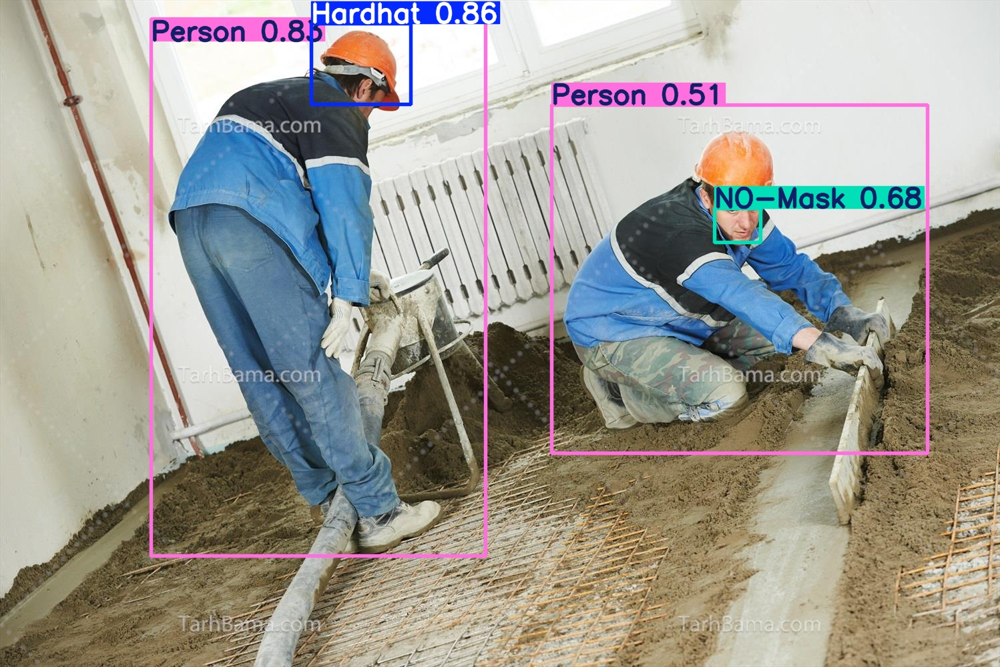
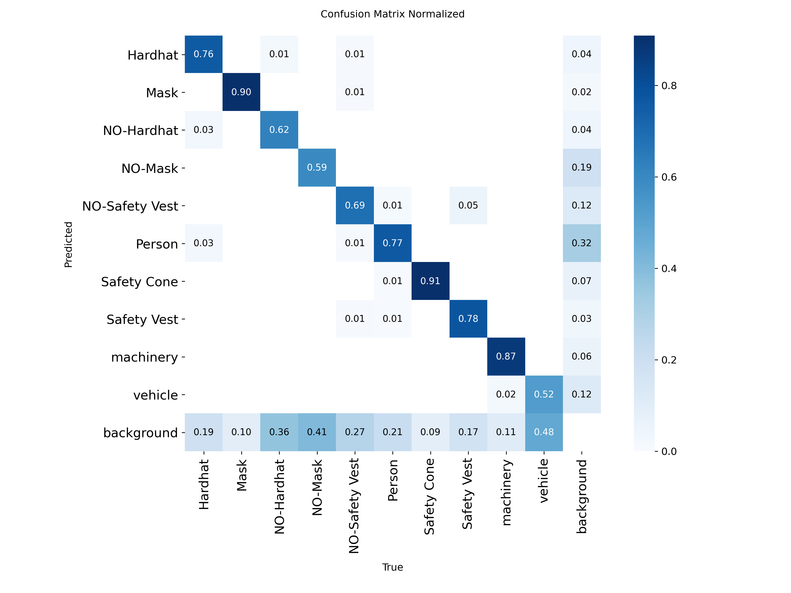
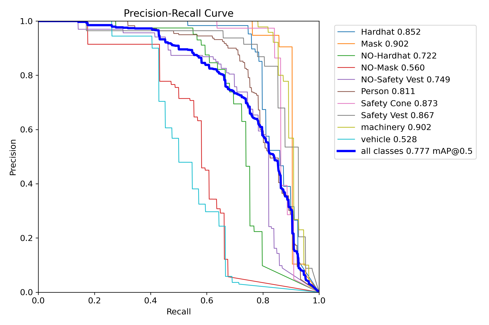

# 🦺 AI-Powered Construction Safety Monitoring (YOLOv8)
## سیستم پایش هوشمند ایمنی کارگاه با هوش مصنوعی (YOLOv8)

[](https://www.python.org)
[](https://ultralytics.com)
[](LICENSE)

---

### 🇮🇷 معرفی پروژه (Persian)
این پروژه یک سیستم بینایی ماشین پیشرفته بر پایه **YOLOv8** است که برای شناسایی خودکار تجهیزات ایمنی (PPE) در محیط‌های کارگاهی طراحی شده است. این مدل قادر است ۱۰ کلاس مختلف از جمله کلاه ایمنی، جلیقه، ماسک و ماشین‌آلات را با دقت بالا شناسایی کند.

#### 📊 تحلیل خروجی‌های مدل
بر اساس نمودارهای استخراج شده از پوشه `runs/detect/train`:

* **عملکرد کلی:** مدل به میانگین دقت **77.7% (mAP@50)** رسیده است.
* **نقاط قوت:** طبق **Confusion Matrix**، مدل در تشخیص **Safety Cone (91%)** و **Mask (90%)** فوق‌العاده دقیق است.
* **تحلیل نمودار PR:** کلاس‌های **Hardhat** و **Safety Vest** دقت بالای ۸۵٪ دارند که برای ایمنی صنعتی حیاتی است.
* **توزیع داده‌ها:** طبق نمودار `labels.jpg` بیشترین فراوانی مربوط به کلاس **Person** و **Safety Vest** است که تمرکز مدل را بر پایش انسانی نشان می‌دهد.

---

### 🇬🇧 Project Overview (English)
An advanced PPE detection system powered by **YOLOv8**, designed for high-stakes industrial environments. This model monitors safety compliance by detecting 10 distinct classes including helmets, vests, masks, and site machinery.

#### 📈 Performance & Analytics
Analysis of the training results from `runs/detect/train`:

* **Overall Accuracy:** Achieved a robust **mAP@50 of 77.7%**.
* **Model Strengths:** According to the **Normalized Confusion Matrix**, the model excels in detecting **Safety Cones (91%)** and **Masks (90%)**.
* **PR Curve Insights:** High precision-recall scores (>85%) for **Hardhats** and **Vests** ensure reliable safety auditing.
* **Data Distribution:** As shown in `labels.jpg`, the dataset is rich in **Person** and **Safety Vest** instances, optimizing the model for worker-centric monitoring.

---

### 🚀 Model in Action (Test Result) / نمایش عملکرد مدل

| Input Image (Original) | Model Prediction (Inference) |
|---|---|
|  |  |

> **Note:** The model successfully identifies multiple workers and their safety gear simultaneously with high confidence.

---

### 📊 Training Metrics / معیارهای آموزش

| Confusion Matrix | Precision-Recall Curve |
|---|---|
|  |  |

| Training Logs (Loss/mAP) | Label Distribution |
|---|---|
|  |  |

---

### 🛠 Installation & Usage / نصب و اجرا

1. **Clone the Repo:**
   ```bash
   git clone [https://github.com/your-username/HSE-Safety-Detection.git](https://github.com/your-username/HSE-Safety-Detection.git)